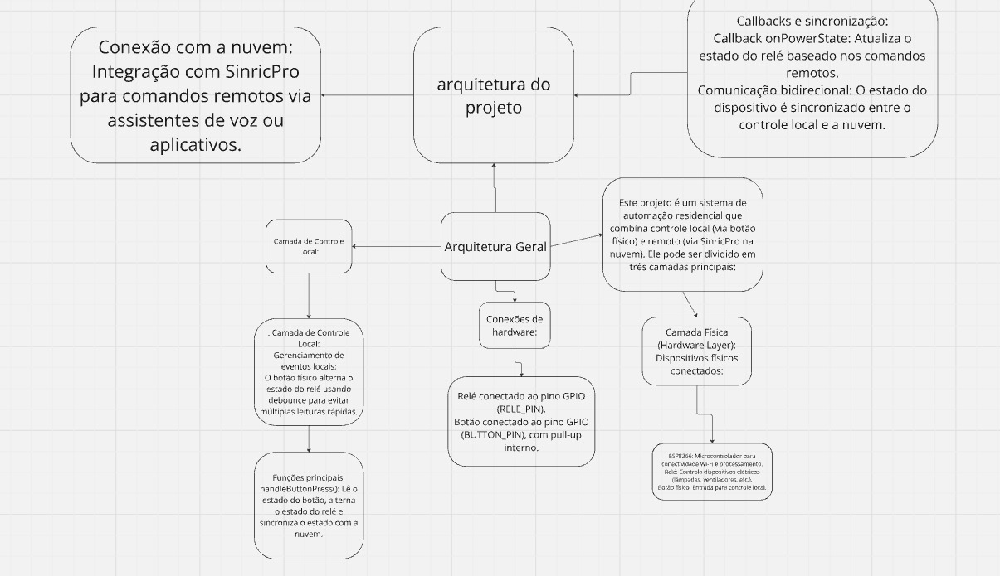

O código configura um ESP8266 para se conectar ao Wi-Fi e ao SinricPro, permitindo controlar um relé pela Alexa ou por um botão físico, com sincronização automática do estado entre os dois.

```cpp
#include <Arduino.h> // Biblioteca base do Arduino pra funções básicas tipo pinos e delays
#include <ESP8266WiFi.h> // Biblioteca pra conectar o ESP8266 na rede Wi-Fi
#include <SinricPro.h> // Biblioteca pra integrar com o SinricPro
#include <SinricProSwitch.h> // Biblioteca específica pra interruptor no SinricPro
```
```cpp
// Dados da Wi-Fi
#define WIFI_SSID "andre" // Nome da rede Wi-Fi
#define WIFI_PASS "andre1997" // Senha da rede
```
```cpp
// Dados do SinricPro
#define APP_KEY "870654aa-d09a-4b1b-b1f9-843ae434f0de" // Key do app SinricPro
#define APP_SECRET "37da78b2-e1dc-4150-8f29-a4631138d481-bc6dc792-d304-43fe-806b-eb21d3d66c59" // Segredo do app SinricPro
#define SWITCH_ID "6733d5c5e68a1fbf3fa9cb62" // ID do dispositivo no SinricPro
#define BAUD_RATE 9600 // Taxa do Serial Monitor (9600 é padrão)
```
```cpp
// Configuração dos pinos
#define BUTTON_PIN 0 // Pino do botão (GPIO 0)
#define RELE_PIN 5 // Pino do relé (GPIO 5)
``` 
```cpp
bool myPowerState = false; // Armazena o estado atual do relé
unsigned long lastBtnPress = 0; // Armazena o tempo do último clique (pra evitar debounce)
```

```cpp
// Callback pra mudar o estado do dispositivo
bool onPowerState(const String &deviceId, bool &state) {
  Serial.printf("Disposotivo %s foi %s (via SinricPro) \r\n", deviceId.c_str(), state ? "ligado" : "desligado");
  myPowerState = state; // Atualiza estado
  digitalWrite(RELE_PIN, myPowerState ? LOW : HIGH); // Liga/desliga o relé (LOW é ligado)
  return true; // Retorna que deu tudo certo
}
```
```cpp
// Função pra conectar na Wi-Fi
void setupWiFi() {
  Serial.printf("\r\n[WiFi]: Conectando na rede");
  WiFi.begin(WIFI_SSID, WIFI_PASS); // Inicia conexão Wi-Fi
  while (WiFi.status() != WL_CONNECTED) { // Fica tentando até conectar
    Serial.printf("."); // Mostra os pontinhos enquanto tenta conectar
    delay(250); // Espera um pouco entre tentativas
  }
  Serial.printf("\r\n[WiFi]: Conectado com sucesso! \r\n");
}
```
```cpp
// Configura o SinricPro
void setupSinricPro() {
  SinricProSwitch &mySwitch = SinricPro[SWITCH_ID]; // Cria o dispositivo interruptor
  mySwitch.onPowerState(onPowerState); // Configura o callback pra mudanças de estado
  SinricPro.begin(APP_KEY, APP_SECRET); // Começa o SinricPro
}
```
```cpp
// Verifica botão físico
void handleButtonPress() {
  if (digitalRead(BUTTON_PIN) == LOW) { // Verifica se o botão tá pressionado
    unsigned long currentMillis = millis();
    if (currentMillis - lastBtnPress > 1000) { // Ignora múltiplos cliques rápidos
      myPowerState = !myPowerState; // Alterna o estado
      digitalWrite(RELE_PIN, myPowerState ? LOW : HIGH); // Liga ou desliga o relé
      Serial.printf("Botão pressionado! Novo estado: %s \r\n", myPowerState ? "ligado" : "desligado");
      SinricPro.switches[0]->sendPowerStateEvent(myPowerState); // Sincroniza estado com SinricPro
      lastBtnPress = currentMillis; // Atualiza tempo do último clique
    }
  }
}
```
```cpp
// Função de configuração inicial
void setup() {
  pinMode(BUTTON_PIN, INPUT_PULLUP); // Configura botão como entrada com pull-up interno
  pinMode(RELE_PIN, OUTPUT); // Configura relé como saída
  digitalWrite(RELE_PIN, HIGH); // Relé começa desligado
  Serial.begin(BAUD_RATE); // Inicia comunicação serial
  setupWiFi(); // Conecta na Wi-Fi
  setupSinricPro(); // Configura SinricPro
  Serial.println("Setup concluído, bora lá!");
}

// Loop principal
void loop() {
  handleButtonPress(); // Verifica o botão
  SinricPro.handle(); // Processa eventos do SinricPro
```
## Demonstração


## Arquitetura do projeto representado no Miro 

